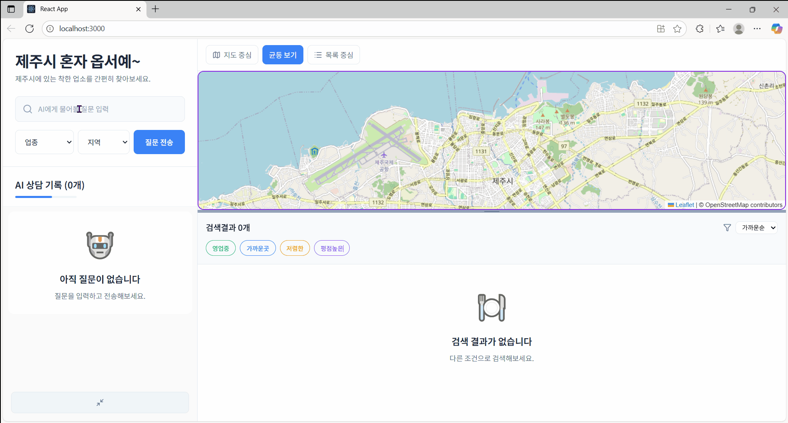

# 🏝️ 제주(서귀포) 착한가격가게 알려주기 AI 서비스

본 프로젝트는 **제주 관광 물가가 많이 올랐기 때문에 여행비용을 줄이기** 위한 서비스입니다.

---

<div style="display: flex; align-items: center; gap: 8px;">
  <div>
    
    
    
    
    
    
    <br/>
    
    
    
    
    
    

  </div>
</div>



## 💡 개발 배경 및 목적

본 프로젝트는 **제주 관광 물가가 많이 올랐기 때문에 여행비용을 줄이기** 위한 서비스입니다.

## ⚙️ 서비스 핵심 기능

**[주요기능]**

- 대화형 구현: 제주시(서귀포) 동을 입력하면 주변 착한 가게를 모두 제공

## 📆 개발 과정

- 개발 기간은 9월 8일부터 9월 16일까지 진행(팀 배정 및 주제선정, 발표 자료 작성 기간 포함)
- 개발 과정은 오전 회의 진행, 및 오전/오후 일정 파악 수행

## 📦 설치 및 실행

```bash
# 데이터 삽입은 python 3.13.7 버전 환경에서 진행
cd DB
docker-compose up -d
# db관련 툴 활용하여 init.sql 실행
cd ../ # JejuGoodStore 경로로 이동
python Scripts/main.py
```

## 🚧 향후 개발 계획

## ©️License

본 프로젝트의 코드는 비상업적 용도로 자유롭게 사용하실 수 있습니다.
상업적 이용이나 수정, 재배포 시에는 사전 연락을 부탁드립니다.

문의는 이메일()로 해주시기 바랍니다.

## 📖 Reference

- 데이터 출처 : [공공데이터 - 서귀포시 디지털혁신과](https://www.data.go.kr/data/15065385/openapi.do)
- 파비콘 출처 : [파비콘](https://www.flaticon.com/kr/free-icons/)

## 👨‍💻👩‍💻 Collaborator

- 프론트 개발
  - [최경준, 한광진](https://github.com/JinwooSean888/GoodStoreProject_Frontend)
- DB 및 백엔드 개발
  - [신진우, 박성현](https://github.com/JinwooSean888/JejuGoodStore_Project)
- AI 개발
  - [신진우](https://github.com/JinwooSean888/JejuGoodStore_Project)
